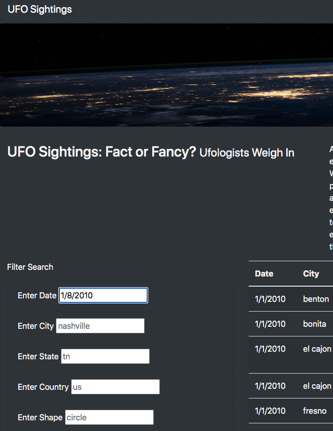
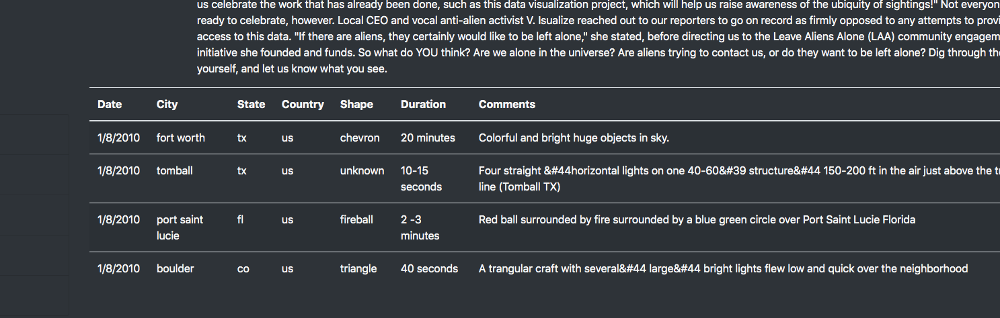

# UFOs

Overview of Project: Explain the purpose of this analysis.
The purpose of the analysis is to create a database for all UFO sitings logged and make the database accessible to users with interactive filter fields. 

Results:

The website is interactive and easy to use. Simply enter filter in the search criteria boxes on the left side of the page and press enter to see your results.

Search Criteria:

Search Results:

Summary: 
One drawback to this design is the site  is unable to be queried by more than one criteria. This could be added with more coding in the for loops but would be complex. 
